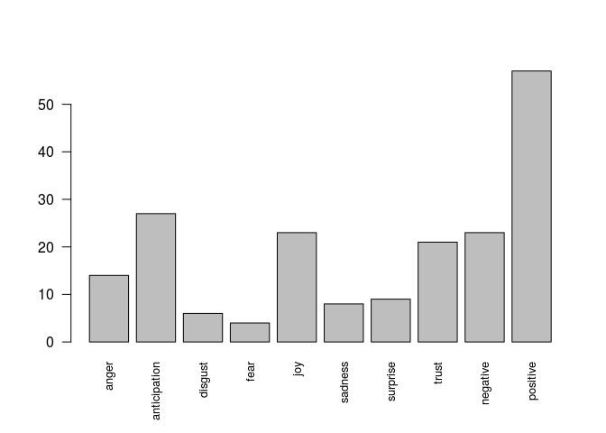

RSelenium Scraping Tutorial
================

This is a basic tutorial that introduces you to scraping dynamic web pages. It explains how I collected data for the scripts in the [wattpad\_analysis](https://github.com/SimoneRebora/Wattpad_analysis) repository.<br/> Remember that **web scraping is a very delicate procedure** and should be applied by complying to a series of rules (or best practices). So **read carefully all my suggestions.**

The following code will work on a virtual browser. So, before running it, you will have to [install Docker](https://docs.docker.com/install/) on your machine.<br/> Once installed it, please start the following container:<br/> <code>$ sudo docker run -d -p 4445:4444 selenium/standalone-firefox:2.53.0</code><br/> *(note that this is not the latest version of Firefox: however, it is the one that was used and tested for the present tutorial)*

Step 0. Upload packages
-----------------------
Note: We assume that R-base is [installed on your computer.](https://www.earthdatascience.org/courses/earth-analytics/document-your-science/setup-r-rstudio/). You may also install R editor like RStudio.

Make sure the packages are installed. The most straightforward is to install tidyverse.
```r
install.packages("tidyverse", dependencies = TRUE )
install.packages("rvest", dependencies = TRUE )
install.packages("Rselenium", dependencies = TRUE )
install.packages("stringi", dependencies = TRUE )


```
Note: You may run into error while installing, make sure you have installed libxml2 in your terminal, on debian/ubuntu write: ``` sudo apt-get install libxml2-dev ```, [httr](https://askubuntu.com/questions/1086870/r-script-returns-error-in-libraryhttr-there-is-no-package-called-httr) and install other packages accordingly.

``` r
library(magrittr)
library(rvest)
```

    ## Loading required package: xml2

``` r
library(RSelenium)
library(stringi)
library(syuzhet)
```

Step 1. Scraping preparation
----------------------------

First, initiate the virtual browser and navigate to the selected page (in our case, [the first chapter of "Pride and Prejudice" on Wattpad](https://www.wattpad.com/20044727-pride-and-prejudice-1813-chapter-i))<br/> To verify the connection, print the title of the page

``` r
remDr <- remoteDriver(port = 4445L) # instantiate remote driver to connect to Selenium Server
remDr$open() # open web browser
```

    ## [1] "Connecting to remote server"
    ## $applicationCacheEnabled
    ## [1] TRUE
    ## 
    ## $rotatable
    ## [1] FALSE
    ## 
    ## $handlesAlerts
    ## [1] TRUE
    ## 
    ## $databaseEnabled
    ## [1] TRUE
    ## 
    ## $version
    ## [1] "45.0.2"
    ## 
    ## $platform
    ## [1] "LINUX"
    ## 
    ## $nativeEvents
    ## [1] FALSE
    ## 
    ## $acceptSslCerts
    ## [1] TRUE
    ## 
    ## $webdriver.remote.sessionid
    ## [1] "dab4dc8d-390f-4d8b-90a5-65e459d6ff2e"
    ## 
    ## $webStorageEnabled
    ## [1] TRUE
    ## 
    ## $locationContextEnabled
    ## [1] TRUE
    ## 
    ## $browserName
    ## [1] "firefox"
    ## 
    ## $takesScreenshot
    ## [1] TRUE
    ## 
    ## $javascriptEnabled
    ## [1] TRUE
    ## 
    ## $cssSelectorsEnabled
    ## [1] TRUE
    ## 
    ## $id
    ## [1] "dab4dc8d-390f-4d8b-90a5-65e459d6ff2e"

``` r
url = "https://www.wattpad.com/20044727-pride-and-prejudice-1813-chapter-i"
remDr$navigate(url)
page_title <- unlist(remDr$getTitle())
cat("The title of the page is:\n", page_title)
```

    ## The title of the page is:
    ##  Pride and Prejudice (1813) - Chapter I - Wattpad

Step 2. Info extraction (Chapter title)
---------------------------------------

Now we can start exploring the page and extracting the relevant information.<br/> For example, the title of the chapter we are currently reading.<br/> *(note that all these operations are performed directly on the html code of the pages. To know where to find the tags--for example, "h2" for the chapter title--please open the page in your browser and visualize its structure--F12 in Firefox)*

``` r
##get title of chapter
chapter_title <- remDr$findElements("css selector", "h2")
chapter_html <- lapply(chapter_title, function(x){x$getElementAttribute("outerHTML")[[1]]})
chapter_title <- lapply(chapter_html, function(x){read_html(x) %>% html_text()} )
chapter_title <- unlist(chapter_title)
chapter_title <- gsub("\n", "", chapter_title)
chapter_title <- gsub("[ \t]+", " ", chapter_title)
cat("Chapter title:\n", chapter_title)
```

    ## Chapter title:
    ##  Chapter I

Step 3. Info extraction (stats)
-------------------------------

Let's extract some statistics: reads, votes, and comments on the current chapter.

``` r
####function to extract numbers
numextract <- function(string){ 
  str_extract(string, "\\-*\\d+\\.*\\d*")
} 
###function to convert numbers
convert_nums <- function(x){
  number_out = numeric()
  for(i in 1 : length(x)){
    x[i] = gsub(" ", "", x[i])
    if(stri_sub(x[i], -1) == "K"){
      x[i] <- gsub('K', '', x[i])
      number_out[i] <- as.numeric(x[i])*1000
      next
    }
    if(stri_sub(x[i], -1) == "M"){
      x[i] <- gsub('M', '', x[i])
      number_out[i] <- as.numeric(x[i])*1000000
      next
    }
    if(stri_sub(x[i], -1) == "+"){
      number_out[i] <- 0
      next
    }
    number_out[i] <- as.numeric(x[i])
  }
  return(number_out)
}

chapter_info <- remDr$findElements("css selector", ".story-stats")
chapter_html <- lapply(chapter_info, function(x){x$getElementAttribute("outerHTML")[[1]]})
doc <- read_html(chapter_html[[1]])
  
chapter_reads <- doc %>% html_nodes(".reads") %>% html_text()
dummy <-gsub("\n", " ", chapter_reads)
chapter_reads <- gsub("[ \t]+", " ", dummy) %>% convert_nums()

chapter_votes <- doc %>% html_nodes(".votes") %>% html_text()
dummy <-gsub("\n", " ", chapter_votes)
chapter_votes <- gsub("[ \t]+", " ", dummy) %>% convert_nums()

chapter_comments <- doc %>% html_nodes(".comments") %>% html_text()
dummy <-gsub("\n", " ", chapter_comments)
chapter_comments <- gsub("[ \t]+", " ", dummy) %>% convert_nums()

cat("Chapter reads:", chapter_reads,
    "\nChapter votes:", chapter_votes,
    "\nChapter comments:", chapter_comments)
```

    ## Chapter reads: 2700000 
    ## Chapter votes: 26200 
    ## Chapter comments: 11400

Step 4. Paragraphs extraction (text)
------------------------------------

Now we can move to the text and start its extraction.<br/> First, the commented paragraphs.<br/> *(note: as sometimes only a part of the chapter is shown, we have to move to the page bottom, so that also the following part can appear)*

``` r
## Move to bottom
cat("Moving to page bottom (please wait a bit...)\n")
```

    ## Moving to page bottom (please wait a bit...)

``` r
webElem <- remDr$findElement("css", "body")
for(down_page in 1:10){
    webElem$sendKeysToElement(list(key = "end"))
  Sys.sleep(3) # wait three seconds (to not overcharge the server...)
  print(down_page)
}
```

    ## [1] 1
    ## [1] 2
    ## [1] 3
    ## [1] 4
    ## [1] 5
    ## [1] 6
    ## [1] 7
    ## [1] 8
    ## [1] 9
    ## [1] 10

``` r
## Get all paragraphs and comment numbers
paragraphs_tmp <- remDr$findElements("xpath", "//div[contains(@class, 'page highlighter')]/div/pre")
paragraphs_html <- lapply(paragraphs_tmp, function(x){x$getElementAttribute("outerHTML")[[1]]})

## Process paragraphs and comment numbers
chapter_paragraphs <- character()
chapter_paragraphs_comments <- character()
for(i in 1:length(paragraphs_html)){
  doc <- read_html(paragraphs_html[[i]])
  chapter_paragraphs_tmp <- doc %>% html_nodes("p") %>% html_text()
  chapter_paragraphs_comments_tmp <- doc %>% html_nodes(xpath = '//*[@class="num-comment"]') %>% html_text()
  for(i in 1:length(chapter_paragraphs_tmp)){
    chapter_paragraphs_tmp[i] <- unlist(strsplit(chapter_paragraphs_tmp[i], "\n"))[1]
  }
  chapter_paragraphs <- c(chapter_paragraphs, chapter_paragraphs_tmp)
  chapter_paragraphs_comments <- c(chapter_paragraphs_comments, chapter_paragraphs_comments_tmp)
}

## Show results
chapter_paragraphs_df <- data.frame(paragraph = chapter_paragraphs, num_comments = chapter_paragraphs_comments, stringsAsFactors = F)
head(chapter_paragraphs_df)
```

    ##                                                                                                                                                                                                                                                           paragraph
    ## 1                                                                                                                                             It is a truth universally acknowledged, that a single man in possession of a good fortune, must be in want of a wife.
    ## 2 However little known the feelings or views of such a man may be on his first entering a neighbourhood, this truth is so well fixed in the minds of the surrounding families, that he is considered the rightful property of some one or other of their daughters.
    ## 3                                                                                                                                                        "My dear Mr. Bennet," said his lady to him one day, "have you heard that Netherfield Park is let at last?"
    ## 4                                                                                                                                                                                                                               Mr. Bennet replied that he had not.
    ## 5                                                                                                                                                                      "But it is," returned she; "for Mrs. Long has just been here, and she told me all about it."
    ## 6                                                                                                                                                                                                                                        Mr. Bennet made no answer.
    ##     num_comments
    ## 1 \n    3.3K\n  
    ## 2  \n    416\n  
    ## 3  \n    409\n  
    ## 4  \n    117\n  
    ## 5   \n    67\n  
    ## 6  \n    120\n

Step 5. Comments extraction (just the first paragraph)
------------------------------------------------------

Now the most complex (and important) part of the scraping starts!<br/> Let's extract the comments to the first paragraph ("It is a truth universally acknowledged...")<br/> As you might have noticed, they are 3,300, so for a demonstration we'll extract only a part of them (one hundred)

``` r
##find all commented paragraphs
CommentsButton <- remDr$findElements("class name", "num-comment")

##find comments at page bottom
CommentsBottom <- remDr$findElements("class name", "comment")
comments_at_bottom <- length(CommentsBottom)
cat("Comments at page bottom:", comments_at_bottom)
```

    ## Comments at page bottom: 2

``` r
## Let's work on the first paragraph
WP_comment <- 1

## define function to click buttons
click_button <- function(NextPageButton){
  tryCatch(
    NextPageButton$clickElement()
    ,
    ## But if an error occurs, do the following: 
    error=function(error_message) {
      message("Yet another error message in catch_button.")
      message("Here is the actual R error message:")
      message(error_message)
      message("\nHOWEVER don't worry, we can still go on!!!\n\n")
      return("iserror")
    }
  )
}

## first try, will probably get an error
button_clicked <- click_button(CommentsButton[[WP_comment]])
```

    ## 
    ## Selenium message:Element is not clickable at point (638.5, 15.5). Other element would receive the click: <form class="form-horizontal dropdown" role="form" name="search" action="/search/" autocomplete="off"></form>
    ## Command duration or timeout: 64 milliseconds
    ## Build info: version: '2.53.1', revision: 'a36b8b1', time: '2016-06-30 17:37:03'
    ## System info: host: 'b5d224a62e74', ip: '172.17.0.2', os.name: 'Linux', os.arch: 'amd64', os.version: '4.15.0-62-generic', java.version: '1.8.0_91'
    ## Driver info: org.openqa.selenium.firefox.FirefoxDriver
    ## Capabilities [{applicationCacheEnabled=true, rotatable=false, handlesAlerts=true, databaseEnabled=true, version=45.0.2, platform=LINUX, nativeEvents=false, acceptSslCerts=true, webStorageEnabled=true, locationContextEnabled=true, browserName=firefox, takesScreenshot=true, javascriptEnabled=true, cssSelectorsEnabled=true}]
    ## Session ID: 449720c0-c4e4-4353-902c-c2b174695f58

    ## Yet another error message in catch_button.

    ## Here is the actual R error message:

    ## 
    ## HOWEVER don't worry, we can still go on!!!

``` r
## so, move up the page a bit...
if(class(button_clicked) == "character"){
    webElem <- remDr$findElement("css", "body")
    webElem$sendKeysToElement(list(key = "up_arrow"))
    webElem$sendKeysToElement(list(key = "up_arrow"))
    ## and try again!!
    button_clicked <- click_button(CommentsButton[[WP_comment]])
    if(class(button_clicked) == "character"){
        webElem <- remDr$findElement("css", "body")
        webElem$sendKeysToElement(list(key = "up_arrow"))
        webElem$sendKeysToElement(list(key = "up_arrow"))
        ## and try again!!
        button_clicked <- click_button(CommentsButton[[WP_comment]])
        ## if it didn't work, well, we might have to restart everything :(
    }
}
```

    ## 
    ## Selenium message:Element is not clickable at point (638.5, 46.5). Other element would receive the click: <form class="form-horizontal dropdown" role="form" name="search" action="/search/" autocomplete="off"></form>
    ## Command duration or timeout: 65 milliseconds
    ## Build info: version: '2.53.1', revision: 'a36b8b1', time: '2016-06-30 17:37:03'
    ## System info: host: 'b5d224a62e74', ip: '172.17.0.2', os.name: 'Linux', os.arch: 'amd64', os.version: '4.15.0-62-generic', java.version: '1.8.0_91'
    ## Driver info: org.openqa.selenium.firefox.FirefoxDriver
    ## Capabilities [{applicationCacheEnabled=true, rotatable=false, handlesAlerts=true, databaseEnabled=true, version=45.0.2, platform=LINUX, nativeEvents=false, acceptSslCerts=true, webStorageEnabled=true, locationContextEnabled=true, browserName=firefox, takesScreenshot=true, javascriptEnabled=true, cssSelectorsEnabled=true}]
    ## Session ID: 449720c0-c4e4-4353-902c-c2b174695f58

    ## Yet another error message in catch_button.

    ## Here is the actual R error message:

    ## 
    ## HOWEVER don't worry, we can still go on!!!

``` r
##Check screenshot to verify that the pop-up with comments was opened
#remDr$screenshot(display = TRUE)

## If the comments page was correctly opened, start extracting the comments  
if(class(button_clicked) != "character"){
  cat("Paragraph connected\nStarting retrieval\n\n\n")
  Sys.sleep(3)
  ###Show more comments
    MoreCommButton <- remDr$findElements("class name", "show-more")
    for(i in 1:9){
      cat("Retrieving more comments", i*10, "\n")
      button_clicked <- click_button(MoreCommButton[[2]])
      if(class(button_clicked) == "character"){break}
      Sys.sleep(3)
    }
    #remDr$screenshot(display = TRUE)
    ###Extract and clean comments
    comments <- remDr$findElements("class", "comment")
    comments_html <- lapply(comments, function(x){x$getElementAttribute("outerHTML")[[1]]})
    clean_comments <- character()
    for(i in comments_at_bottom:length(comments_html)){
      doc <- read_html(comments_html[[i]])
      comment_html <- doc %>% html_nodes(".header")
      clean_comments[i-comments_at_bottom] <- doc %>% html_nodes("pre") %>% html_text()
    }
    cat("\nTotal retrieved comments:", length(clean_comments))
}
```

    ## Paragraph connected
    ## Starting retrieval
    ## 
    ## 
    ## Retrieving more comments 10 
    ## Retrieving more comments 20 
    ## Retrieving more comments 30 
    ## Retrieving more comments 40 
    ## Retrieving more comments 50 
    ## Retrieving more comments 60 
    ## Retrieving more comments 70 
    ## Retrieving more comments 80 
    ## Retrieving more comments 90 
    ## 
    ## Total retrieved comments: 100

``` r
if(class(button_clicked) == "character"){
  cat("The comments page was not correctly opened.\nYou might have to restart the process.\n")
}
```

Step Extra. Sentiment analysis
------------------------------

To conclude, we can run sentiment analysis on the comments, to see which are the dominant emotions

``` r
full_emotions <- get_nrc_sentiment(clean_comments[1])
```

    ## Warning: `as_dictionary()` is soft-deprecated as of rlang 0.3.0.
    ## Please use `as_data_pronoun()` instead
    ## This warning is displayed once per session.

    ## Warning: `new_overscope()` is soft-deprecated as of rlang 0.2.0.
    ## Please use `new_data_mask()` instead
    ## This warning is displayed once per session.

    ## Warning: The `parent` argument of `new_data_mask()` is deprecated.
    ## The parent of the data mask is determined from either:
    ## 
    ##   * The `env` argument of `eval_tidy()`
    ##   * Quosure environments when applicable
    ## This warning is displayed once per session.

    ## Warning: `overscope_clean()` is soft-deprecated as of rlang 0.2.0.
    ## This warning is displayed once per session.

``` r
for(i in 2:length(clean_comments)){
  full_emotions <- full_emotions + get_nrc_sentiment(clean_comments[i])
}
par(las=2)
barplot(t(full_emotions)[,1], cex.names=0.8)
```



To conclude: some important notes
---------------------------------

Now everything is ready to start crawling the Wattapad website!<br/> However, remember that:
- scraping can become ineffective (and even dangerous) if you don't **add pauses between each operation!** (always use the *Sys.sleep* function to make the server breath a bit between your requests)
- please **inform Wattpad directly,** before starting any scraping activity on their website (see their [terms of use](https://policies.wattpad.com/terms))
- remember that **the data you will be dealing with is very sensitive.** So don't share it openly, protect the privacy of the users, and always comply to the current legislation (for more information on **copyright exceptions for research purposes** in Germany--the country from where I realized the scraping--see [here](https://www.clarin.eu/content/clic-copyright-exceptions-germany))

*Note: the present script was designed specifically for [the chosen webpage](https://www.wattpad.com/20044727-pride-and-prejudice-1813-chapter-i), and tested on 12 September 2019. If the structure of the page will change, it might not be effective anymore.*
